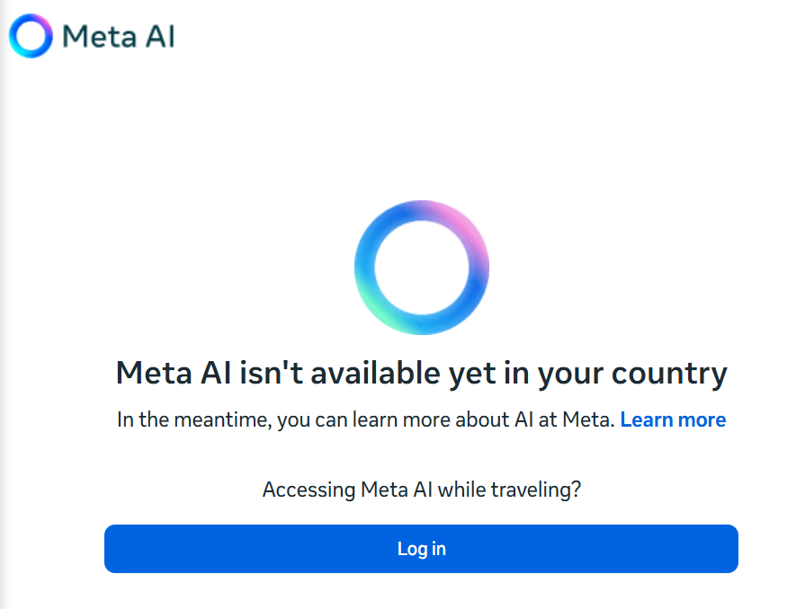
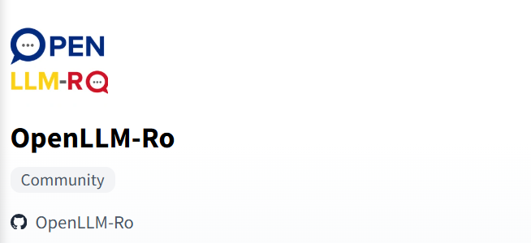

# Free-GenAI
free-genai-bootcamp-2025

# first day

# Meta-ai is not available in Romania at the moment.

I use my phone and used the meta ai on my whatsap.

- which LLM model are you running?
- Answer: i'm based on LLaMA , a state-of-the-art large language model developed by Meta.

- Are you a single model? what is your paramter count?
- Answer: i'm a single model, and i have 70 billion parameters. I'm one of the larger models in the LLaMA 2 family.

In Romania we use the OpenLLMA-RO

